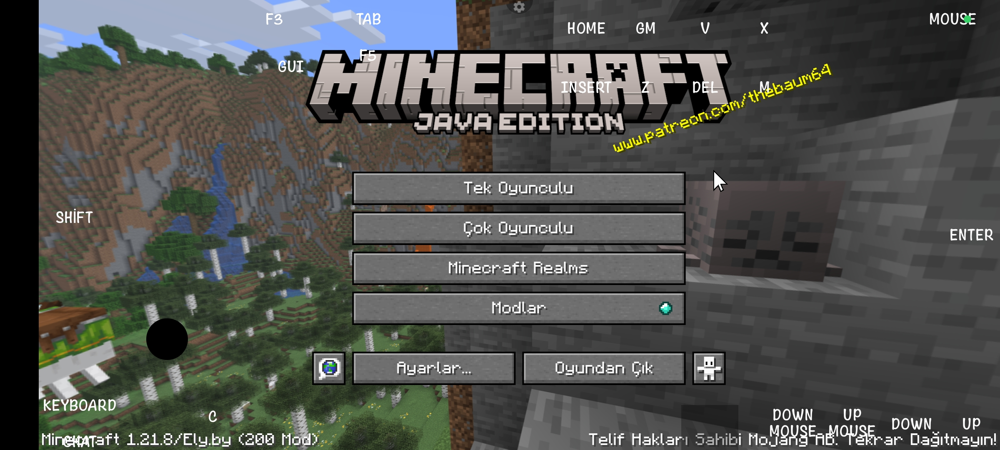

Download mods/resourcepacks. Open Mojo Launcher and click "Open Game Directory". Come to downloads from 3 shits on the left corner. Open downloads, click downloaded .zip file and extract all downloaded mods to MojoLauncher>instances>fabric-loader-0.18-1.21.8-xxxx>mods directory.
If you downloaded the .zip you need to extract .zip file to MojoLauncher>instances/fabric-loader-0.18-1.21.8-xxxx>resourcepacks directory.

